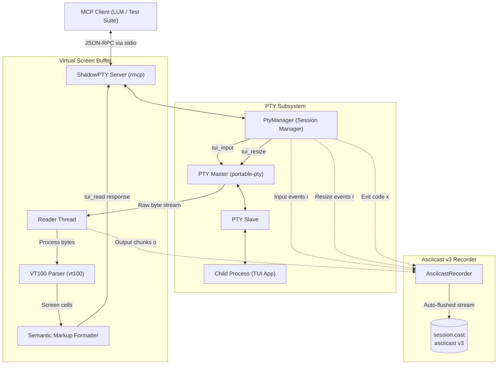

# ShadowPTY

[](LICENSE-MIT)
[-orange.svg)](https://www.rust-lang.org)
[](https://docs.asciinema.org/manual/asciicast/v3/)
[](https://modelcontextprotocol.io)

**ShadowPTY** (`shadowpty`) is a high-performance, headless Model Context Protocol (MCP) server written in Rust that enables LLM agents, automated testing suites, and CI pipelines to interactively drive, inspect, and **record** Text User Interface (TUI) applications.

It allocates a real pseudo-terminal (PTY) on macOS and Linux, maintains an in-memory 2D virtual screen grid using `vt100`, parses ANSI escape sequences into token-efficient semantic markup, and **natively records complete interactive sessions in the standard `asciicast v3` format** for immediate replay with `asciinema` or integration into test reports.

---

## Key Features

- 📹 **Native `asciicast v3` Session Recording**:
  Record complete interactive terminal sessions directly to spec-compliant `.cast` files with microsecond-precision delta timestamps. Captures input (`i`), raw output (`o`), terminal window resizes (`r`), and exit codes (`x`) with zero external daemon dependencies.
- ⚡ **Native PTY Allocation**:
  Spawns real interactive processes (shells, `htop`, `lazygit`, custom TUIs) via `portable-pty` with true job control, signals, and process lifecycle management.
- 🖥️ **Headless Virtual Terminal Buffer**:
  Maintains an accurate 2D virtual terminal screen state in memory using `vt100`, emulating a full `xterm-256color` terminal without requiring an active X11, Wayland, or Quartz display server.
- 🏷️ **Semantic Style Tagging for LLMs**:
  Formats terminal screen reads into concise, XML-like semantic tags (e.g. `<fg:green><bold>SUCCESS</bold></fg>`) that collapse adjacent spans and strip excessive blank padding to minimize LLM token consumption.
- ⌨️ **Intuitive Key Token Translation**:
  Accepts readable key tokens like `<ENTER>`, `<ESC>`, `<UP>`, `<DOWN>`, `<TAB>`, `<BACKSPACE>`, `<CTRL+C>`, `<ALT+X>`, and `<F1>`–`<F12>`, as well as raw text input.
- 🔄 **Dynamic Window Resizing**:
  Dynamically resize the PTY and virtual screen buffer on the fly (`tui_resize`) to test responsive TUI behavior, re-rendering, and layout adaptability.
- 🔌 **Native Model Context Protocol (MCP)**:
  Exposes 4 standardized MCP tools over `stdio` using `rmcp` 3.4+, ready to drop into Claude Desktop, Antigravity (`agy`), Cursor, and custom agent frameworks.
- 🛡️ **Protocol Isolation & Safety**:
  Internal diagnostics, traces, and child process logs are strictly piped to `stderr`, guaranteeing that `stdout` remains 100% clean and uncorrupted for JSON-RPC messages.
- ❄️ **Reproducible Nix Environment**:
  Includes a Nix Flake (`flake.nix`) providing complete builds via `crane` and a development shell bundled with Rust toolchains and `asciinema`.

---

## 🛠️ MCP Tools Reference

ShadowPTY exposes 4 MCP tools:

### 1. `tui_start`
Spawns a command inside a new pseudo-terminal session, terminating any previous session.

- **Parameters**:
  - `command` (*string*, required): Executable to launch (e.g. `"htop"`, `"lazygit"`, `"bash"`, `"nix-shell"`).
  - `args` (*array of strings*, optional): Command-line arguments.
  - `rows` (*integer*, optional, default: `24`): Initial terminal rows.
  - `cols` (*integer*, optional, default: `80`): Initial terminal columns.
  - `record_path` (*string*, optional): Destination path where the session will be recorded in **asciicast v3** format (`.cast`).
- **Example**:
  ```json
  {
    "command": "htop",
    "rows": 30,
    "cols": 100,
    "record_path": "/tmp/htop-session.cast"
  }
  ```

### 2. `tui_input`
Sends keystrokes, text, and control sequences to the active application's PTY stdin.

- **Parameters**:
  - `keys` (*string*, required): Text or key tokens.
- **Supported Special Tokens**:
  - **Navigation**: `<UP>`, `<DOWN>`, `<LEFT>`, `<RIGHT>`, `<HOME>`, `<END>`, `<PAGEUP>`, `<PAGEDOWN>`
  - **Control**: `<ENTER>`, `<RETURN>`, `<ESC>`, `<ESCAPE>`, `<TAB>`, `<SPACE>`, `<BACKSPACE>`, `<DELETE>`
  - **Function Keys**: `<F1>` through `<F12>`
  - **Modifiers**: `<CTRL+X>` or `<C-X>` (e.g. `<CTRL+C>`, `<CTRL+D>`), `<ALT+X>` or `<M-X>`
- **Example**:
  ```json
  { "keys": "echo 'Hello ShadowPTY'<ENTER>" }
  ```

### 3. `tui_resize`
Resizes the pseudo-terminal window and virtual screen grid to test responsive layouts and window change handlers.

- **Parameters**:
  - `rows` (*integer*, required): New row count.
  - `cols` (*integer*, required): New column count.
- **Example**:
  ```json
  { "rows": 40, "cols": 120 }
  ```

### 4. `tui_read`
Captures the current visible state of the terminal screen formatted with semantic style markup.

- **Parameters**: None.
- **Example Output**:
  ```text
  <fg:green><bold>SUCCESS</bold></fg> Process completed in 0.42s
  <fg:bright-black>Press [q] to exit</fg>
  ```

---

## 🏗️ Architecture


---

## 📹 Interactive Session Recording (`asciicast v3`)

ShadowPTY features first-class, zero-overhead session recording adhering to the official **[asciicast v3 specification](https://docs.asciinema.org/manual/asciicast/v3/)**.

### Why Record Sessions?

| Use Case | Benefit |
| :--- | :--- |
| **Agent Visual Audit Trail** | Record exactly what the LLM agent saw, typed, and triggered during complex multi-step terminal tasks. |
| **CI / Automated Testing Artifacts** | Attach `.cast` files to test runs so failed TUI assertions can be visually inspected and replayed rather than debugging raw logs. |
| **Demos & Documentation** | Generate reproducible terminal recordings that can be embedded into documentation, rendered to SVG/GIF with tools like `agg`, or played on the web. |
| **Deterministic Debugging** | Step through exact keystroke sequences and terminal resize events with millisecond precision. |

### How It Works

When you supply `record_path` to `tui_start`, ShadowPTY immediately initializes the `.cast` file with a spec-compliant v3 header:

```json
{"version": 3, "term": {"cols": 100, "rows": 35, "type": "xterm-256color"}, "timestamp": 1726960000, "command": "nix-shell"}
```

As the session runs, every event is streamed and auto-flushed with relative delta timestamps:

```json
[0.152, "o", "\u001b[?2004h[nix-shell:~]$ "]
[1.204, "i", "fastfetch\r"]
[0.015, "o", "fastfetch\r\n"]
[0.342, "r", "120x40"]
[0.850, "x", "0"]
```

### Replaying Recordings

Because recordings follow standard `asciicast v3`, they can be played back in any terminal with `asciinema`:

```bash
# Replay with real timing
asciinema play session.cast

# Replay at 2x speed
asciinema play -s 2 session.cast

# Render to an animated SVG or GIF (using agg)
agg session.cast session.gif
```

---

## 🚀 Real-World Showcase: Recording `fastfetch` in `nix-shell`

[](https://asciinema.org/a/h4tKuB4nJSyDvGUo)

A complete recorded session is included in [`examples/neofetch/`](examples/neofetch/):

1. **Started** an isolated `nix-shell -p fastfetch` in a 35x100 PTY session with recording enabled.
2. **Sent** `fastfetch<ENTER>` to inspect system configuration and hardware details.
3. **Captured** the formatted screen state containing ANSI color palettes and ASCII art.
4. **Terminated** cleanly with `exit<ENTER>`.

To view the step-by-step MCP prompt and response logs, see [`examples/neofetch/prompt.md`](examples/neofetch/prompt.md).  
To replay the actual recorded session:

```bash
asciinema play examples/neofetch/recording.cast
```

---

## 📦 Installation & Setup

### Via `npx` (Zero Installation)

Run immediately without compiling:

```bash
npx -y @azimovlabs/mcp-shadow-pty
```

### Building from Source

Ensure you have Rust 1.88+ installed:

```bash
git clone https://github.com/pplanel/ShadowPTY.git
cd ShadowPTY
cargo build --release
```

The compiled binary will be at `target/release/shadowpty`.

### Using Nix Flake

Run directly with Nix without manual compilation:

```bash
nix run github:pplanel/ShadowPTY
```

Or enter a reproducible development shell equipped with Rust toolchains and `asciinema`:

```bash
nix develop
```

---

## 🔌 Integrating with MCP Clients

### Recommended: Via `npx`

#### Claude Desktop / Claude CLI

Add to your `claude_desktop_config.json`:

```json
{
  "mcpServers": {
    "shadow-pty": {
      "command": "npx",
      "args": [
        "-y",
        "@azimovlabs/mcp-shadow-pty"
      ]
    }
  }
}
```

#### Antigravity (`antigravity-cli`)

Add to `~/.gemini/config/mcp_config.json`:

```json
{
  "mcpServers": {
    "shadow-pty": {
      "command": "npx",
      "args": [
        "-y",
        "@azimovlabs/mcp-shadow-pty"
      ]
    }
  }
}
```

#### Cursor

Add to your Cursor MCP settings (`command` type):
- **Command**: `npx`
- **Args**: `-y`, `@azimovlabs/mcp-shadow-pty`

### Alternative: Via Locally Compiled Binary

```json
{
  "mcpServers": {
    "shadow-pty": {
      "command": "/path/to/ShadowPTY/target/release/shadowpty",
      "args": []
    }
  }
}
```

---

## 🧪 Testing & Quality

ShadowPTY includes a comprehensive suite of unit and integration tests covering PTY lifecycle management, ANSI parsing, key translation, and asciicast v3 file recording:

```bash
# Run unit and integration tests
cargo test --all-targets

# Run strict Clippy checks
cargo clippy --all-targets -- -D warnings

# Check code formatting
cargo fmt --check

# Check Nix flake packages and apps
nix flake check
```

---

## 📄 License

Licensed under either of:

- Apache License, Version 2.0 ([LICENSE-APACHE](LICENSE-APACHE))
- MIT License ([LICENSE-MIT](LICENSE-MIT))

at your option.
