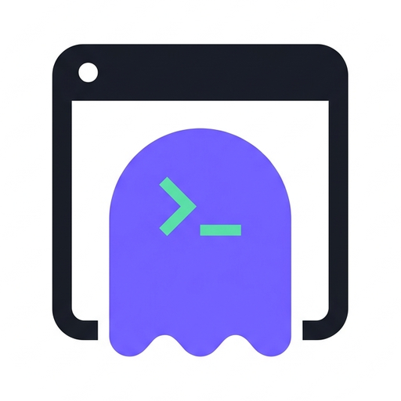

<p align="center">
  
</p>

<h1 align="center">ShadowPTY</h1>

<p align="center">
  <strong>Let your AI assistant use terminal apps the way a person does — and prove it works.</strong>
</p>

<p align="center">
  <a href="LICENSE-MIT"></a>
  <a href="https://modelcontextprotocol.io"></a>
  <a href="https://www.npmjs.com/package/@azimovlabs/mcp-shadow-pty"></a>
</p>

ShadowPTY gives AI assistants (Claude, Gemini, Cursor, …) a real terminal they can operate: open an app, type, press keys, look at the screen, take screenshots, and record everything. That turns "the assistant says it works" into "here's the recording and the screenshot showing it works."

<!-- TODO: replace with a GIF of an agent driving a TUI -->
[](https://asciinema.org/a/h4tKuB4nJSyDvGUo)

---

## Why it exists

A lot of software lives in the terminal: CLIs, installers, dashboards like `htop`, Git tools like `lazygit`, editors, REPLs, internal admin tools. These interfaces are hard to test and impossible for an AI assistant to use — it can run a command, but it can't *see* a full-screen app, press arrow keys, or notice that the status bar turned red.

ShadowPTY closes that gap. The assistant gets eyes (the screen, with colors), hands (the keyboard), patience (it can wait for something to appear), and a camera (screenshots and recordings).

---

## Who it's for

### Product managers and designers
- **Check a flow without setting anything up.** "Walk through the onboarding wizard and screenshot each step."
- **Review what users actually see**: colors, layout, error messages, at a real terminal size.
- **Get artifacts you can share**: PNG screenshots for the ticket, a replayable recording for the demo.

### QA and TDD practitioners
- **Write the test before the feature** in plain language: *"When I press `q`, a confirmation dialog appears with 'Quit? (y/n)' highlighted."* Let the assistant run it red, implement, run it green.
- **Assert on what matters**: exact text, where it appears on screen, and its color ("the error line is red", "the selected item is inverted").
- **No flaky sleeps.** The assistant waits for the text to appear (or for the screen to settle) instead of guessing how long to pause.
- **Evidence on every run**: a recording and screenshots you can attach to a bug report or CI artifact, and replay step by step.

### Developers of CLI and TUI tools
- Let an assistant **reproduce a bug interactively**, resize the terminal to test layouts, and confirm the fix.
- Run **several apps side by side** — e.g. a server in one session and a client in another.

### Agent and platform builders
- A drop-in [MCP](https://modelcontextprotocol.io) server that gives any agent reliable terminal control, with clean process cleanup.

---

## What it looks like

You ask your assistant, in plain words:

> Open `htop` in a 155×43 terminal. Wait for it to load, take a screenshot, then press F6, choose "memory" and confirm the list is sorted by memory. Record the session.

Behind the scenes the assistant uses ShadowPTY to:

1. **Start** `htop` in a fresh terminal, recording to a file.
2. **Wait** until the screen stops changing.
3. **Screenshot** it — the assistant actually sees the image.
4. **Press** `F6`, then **wait** for the "Sort by" menu to appear.
5. **Read** the screen and check the order and highlighting.
6. **Close** the app and everything it started.

And you get back: the answer, the screenshots, and a recording you can replay with `asciinema play`.

What the assistant "reads" is the screen as text, with colors kept:

```text
<fg:green><bold>✔ 12 tests passed</bold></fg>
<fg:red>✘ 1 failed: login_rejects_bad_password</fg>
<inverse> q </inverse> Quit   <inverse> r </inverse> Rerun
```

---

## Capabilities at a glance

| | |
| :--- | :--- |
| ⌨️ **Type and press keys** | Text, Enter, arrows, F-keys, Ctrl/Alt combos, pasted scripts |
| 👀 **Read the screen** | Text with colors and styles, exactly as laid out |
| ⏳ **Wait for things** | Until some text appears, or until the screen settles — no fixed sleeps |
| 📸 **Screenshots** | PNG the assistant can see, or SVG for pixel-exact comparisons |
| 🎬 **Recordings** | Standard [asciinema](https://asciinema.org) files with real timing |
| 📐 **Resize** | Test how the app adapts to small and large windows |
| 🧩 **Several apps at once** | Each in its own named session |
| 🧹 **Clean shutdown** | Closing a session stops the app and anything it spawned |

Works on **macOS and Linux**.

---

## Get started

### 1. Connect it to your assistant

Nothing to install — it runs through `npx` (requires Node.js):

**Claude Code**

```bash
claude mcp add shadow-pty -- npx -y @azimovlabs/mcp-shadow-pty
```

**Claude Desktop, Gemini CLI / Antigravity, Cursor and other MCP clients** — add this to the client's MCP config (`claude_desktop_config.json`, `~/.gemini/config/mcp_config.json`, Cursor's MCP settings, …):

```json
{
  "mcpServers": {
    "shadow-pty": {
      "command": "npx",
      "args": ["-y", "@azimovlabs/mcp-shadow-pty"]
    }
  }
}
```

Prefer Nix or building from source? See the [technical reference](docs/reference.md#development).

### 2. Ask for something

Some prompts to try:

- *"Start `bash` in ShadowPTY, run `ls -la`, and tell me what's on screen."*
- *"Open `vim`, type a short poem, save it as `/tmp/poem.txt`, quit, and show me a screenshot before quitting."*
- *"Run our CLI's `init` wizard, accept all defaults, and record the session to `/tmp/init.cast`."*
- *"Test that pressing `?` in our TUI opens the help panel, and that it still fits when the terminal is 80×24."*

### 3. Replay what happened

```bash
asciinema play /tmp/init.cast
```

---

## Using it for TDD

A simple loop that works well with an assistant:

1. **Describe the behavior** as a scenario: *"Given the app is open, when I type `add milk` and press Enter, then 'milk' appears in the list, unchecked."*
2. **Run it red.** The assistant drives the app and reports what it saw instead (with a screenshot).
3. **Implement** the change.
4. **Run it green.** Same scenario, now passing — keep the recording as evidence.
5. **Check the edges**: small terminal size, long text, the app being slow to respond.

Because the assistant waits for real on-screen events instead of fixed delays, these checks stay reliable as the app gets faster or slower.

---

## FAQ

**Does the app know it's being tested?**
No. It runs in a real pseudo-terminal, just like when you open it yourself.

**Can it handle full-screen, colorful apps?**
Yes — it uses the terminal engine from [Alacritty](https://alacritty.org), so layouts, colors, wide characters and redraws render like in a modern terminal. Screenshots and screen text come from the same view, so they always agree.

**What happens if the app crashes?**
The assistant is told the app exited and gets its last output. ShadowPTY itself keeps running.

**Does it leave processes behind?**
No. Closing a session stops the app and everything it started.

**Windows?**
Not yet — macOS and Linux only.

---

## Learn more

- [Technical reference](docs/reference.md) — every tool and parameter, screen format, recording format, architecture.
- [`examples/neofetch/`](examples/neofetch/) — a full recorded example with the assistant's steps.
- [Design proposals](docs/proposals/) — how and why it's built this way.
- [`TODO.md`](TODO.md) — known issues and what's next.

Contributions are welcome: see the development commands in the [technical reference](docs/reference.md#development) and the project guidelines in [`CLAUDE.md`](CLAUDE.md).

---

## License

Licensed under either of [Apache License 2.0](LICENSE-APACHE) or [MIT](LICENSE-MIT), at your option.
