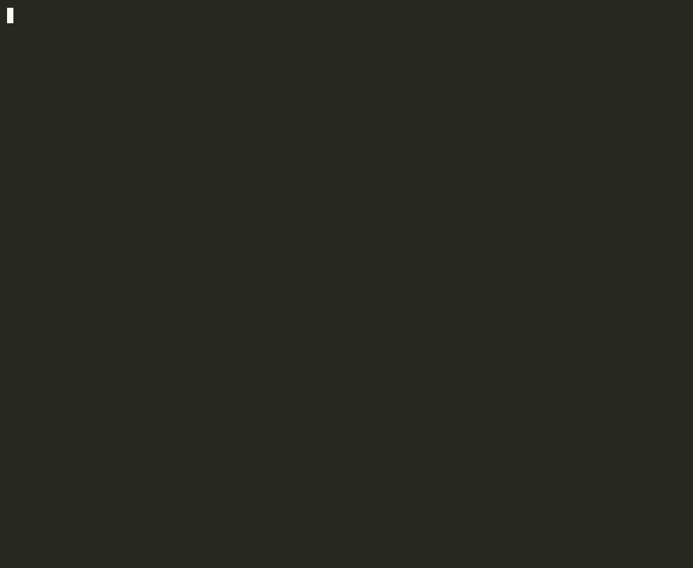
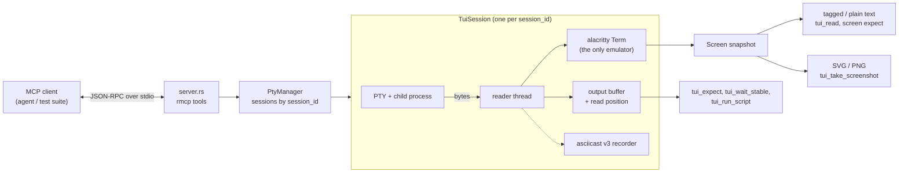

# ShadowPTY technical reference

Tool parameters, screen format, recording format and architecture. For an overview, see the [README](../README.md).

- [Tools](#tools)
- [Reading the screen](#reading-the-screen)
- [Recording](#recording)
- [Architecture](#architecture)
- [Development](#development)
- [Limitations](#limitations)

---

## Tools

ShadowPTY exposes 13 tools. Every tool except `tui_list_sessions` takes an optional `session_id` (default `"default"`); each session has its own process, screen and recording.

| Tool | What it does |
| :--- | :--- |
| [`tui_start`](#tui_start) | Spawn a command in a new PTY session |
| [`tui_input`](#tui_input) | Send keys and text |
| [`tui_paste`](#tui_paste) | Send text as one bracketed paste |
| [`tui_expect`](#tui_expect) | Wait for a literal or regex in new output or on screen |
| [`tui_wait_stable`](#tui_wait_stable) | Wait until output goes quiet |
| [`tui_wait_gone`](#tui_wait_gone) | Wait until text disappears from the screen |
| [`tui_wait_exit`](#tui_wait_exit) | Wait for the process to exit; get its exit code or signal |
| [`tui_run_script`](#tui_run_script) | Run shell commands one by one, collecting each output |
| [`tui_read`](#tui_read) | Read the screen as tagged text |
| [`tui_take_screenshot`](#tui_take_screenshot) | Render the screen to PNG or SVG |
| [`tui_resize`](#tui_resize) | Resize the terminal |
| [`tui_list_sessions`](#tui_list_sessions) | List sessions and whether their process has exited |
| [`tui_end`](#tui_end) | Stop a session and its whole process group |

All waits are capped at 120 seconds.

### `tui_start`

Spawns `command` in a new pseudo-terminal. Starting a `session_id` that is already running stops the old session first (killed and reaped); other sessions are untouched.

| Parameter | Type | Default | |
| :--- | :--- | :--- | :--- |
| `command` | string | required | Executable, e.g. `"htop"`, `"bash"` |
| `args` | string[] | `[]` | Arguments |
| `rows`, `cols` | integer | `24`, `80` | Terminal size |
| `record_path` | string | – | Record the session to this `.cast` file |
| `session_id` | string | `"default"` | |

```json
{ "command": "htop", "rows": 43, "cols": 155, "record_path": "/tmp/htop.cast", "session_id": "htop" }
```

### `tui_input`

Sends text and key tokens.

```json
{ "keys": "echo 'Hello ShadowPTY'<ENTER>" }
```

| Tokens | |
| :--- | :--- |
| Keys | `<ENTER>` `<RETURN>` `<ESC>` `<ESCAPE>` `<TAB>` `<SPACE>` `<BACKSPACE>` `<DELETE>` |
| Navigation | `<UP>` `<DOWN>` `<LEFT>` `<RIGHT>` `<HOME>` `<END>` `<PAGEUP>` `<PAGEDOWN>` |
| Function keys | `<F1>` … `<F12>` |
| Modifiers | `<CTRL+C>` / `<C-C>`, `<ALT+X>` / `<M-X>` |

### `tui_paste`

Sends `text` wrapped in bracketed-paste markers (DECSET 2004), so shells and editors treat a multiline script as one paste rather than typed keys. Text containing the end marker `ESC[201~` is rejected.

### `tui_expect`

Waits until `pattern` appears, or the first of several `patterns`, so the agent doesn't need sleep-and-poll loops.

| Parameter | Type | Default | |
| :--- | :--- | :--- | :--- |
| `pattern` | string | – | Text or regex. Give `pattern` or `patterns` |
| `patterns` | string[] | – | Several; waits for whichever appears first |
| `is_regex` | boolean | `false` | Applies to every pattern |
| `screen_mode` | boolean | `false` | Match the rendered screen instead of new output |
| `timeout_ms` | integer | `10000` | |

- **Stream mode** (default) searches output the agent hasn't seen yet — neither returned by `tui_read` nor matched by an earlier `tui_expect` — so it never matches stale text. A match consumes output up to its end.
- **Screen mode** matches what is actually drawn, including text built from cursor moves and overwrites.
- With `patterns`, the match that starts earliest wins (if two start at the same place, the one listed first). Only output up to that match is consumed. The reply names the winner, numbered from 1, e.g. `Matched pattern 2 of 3 ('Permission denied'): "Permission denied"`.
- If the process exits first, it fails right away and returns the last output.

```json
{ "pattern": "Build (succeeded|failed)", "is_regex": true, "timeout_ms": 60000 }
```

```json
{ "patterns": ["Password:", "Permission denied", "$ "], "timeout_ms": 5000 }
```

### `tui_wait_stable`

Waits until no output has arrived for `quiet_period_ms` (default `100`), up to `max_wait_ms` (default `3000`). Returns immediately if the process has exited. Use it before `tui_read` or a screenshot.

### `tui_wait_gone`

Waits until text is no longer on the rendered screen, e.g. a spinner, `Loading…` or a modal, and reports how long that took. Takes `pattern` or `patterns` (then waits until none of them shows), `is_regex`, and `timeout_ms` (default `10000`).

```json
{ "pattern": "Loading", "timeout_ms": 30000 }
```

```text
'Loading' is no longer on screen in session 'default' (after 1840 ms)
```

- Returns at once if the text isn't showing. If it may not have appeared yet, wait for it first with `tui_expect` and `screen_mode`, then call `tui_wait_gone`.
- Re-checks whenever the screen changes. Fails right away if the process exits with the text still on screen, and on timeout shows the current screen.

### `tui_wait_exit`

Waits until the session's process exits (`timeout_ms`, default `10000`) and reports how it ended, plus any output not yet returned by `tui_read` or `tui_expect` (the last 4000 characters). Returns immediately if the process has already exited. The session stays open, so `tui_read` and screenshots still show the final screen until `tui_end`.

```text
Process in session 'default' exited with code 3.
Unread output:
Build failed: 2 errors
```

A process killed by a signal reports e.g. `killed by signal 9 (SIGKILL)`. If it's still running at the timeout, the call fails with the latest output.

### `tui_run_script`

Runs `commands` one at a time in a shell session, waiting for `prompt_pattern` (default `"$"`, set `is_regex` for a regex) after each, with `timeout_ms` (default `30000`) per command. Returns each command's output. Earlier output is ignored and each command's echo is skipped, so a command that contains the prompt text doesn't end its own wait. Stops at the first command whose prompt doesn't show up.

```json
{ "commands": ["cargo build", "cargo test"], "prompt_pattern": "READY> " }
```

For zsh or custom prompts, set `prompt_pattern` explicitly (e.g. `PS1='READY> '`).

### `tui_read`

Returns the screen as tagged text (see [Reading the screen](#reading-the-screen)). Everything on screen counts as seen: a later stream-mode `tui_expect` only matches newer output.

### `tui_take_screenshot`

Renders the current screen from the same emulator state `tui_read` uses, so text, colors and layout match.

| Parameter | Type | Default | |
| :--- | :--- | :--- | :--- |
| `format` | `"png"` \| `"svg"` | `"png"` | |
| `output_path` | string | – | Absolute path; the parent directory must exist |
| `include_cursor` | boolean | `true` | |
| `scale` | integer | `1` | PNG only (`1` or `2`) |

- Without `output_path`, a PNG is returned inline as an image the agent can see; an SVG is returned as text.
- With `output_path`, the file is written and the tool returns its size in cells, pixels and bytes.
- PNGs use an embedded JetBrains Mono, so they look the same on every machine; box-drawing characters are drawn so borders join between cells. SVG output is deterministic, so it can be used for golden-file tests.
- Handles 16/256/truecolor, colors the app redefines (OSC 4/10/11), bold, dim, italic, inverse, hidden, strikethrough, underline styles, wide and combining characters, and the cursor shape.

### `tui_resize`

Resizes the PTY and the screen (`rows`, `cols`), to test how an app re-lays out. Text is re-wrapped like a real terminal.

### `tui_list_sessions`

```json
[
  { "id": "build", "command": "sh", "pid": 12001, "rows": 43, "cols": 155, "recording": false, "exit_status": { "exit_code": 0 } },
  { "id": "htop", "command": "htop", "pid": 12345, "rows": 43, "cols": 155, "recording": true, "exit_status": null }
]
```

`exit_status` is `null` while the process runs, then `{ "exit_code": N }`, `{ "signal": N }`, or `"unknown"` if the status couldn't be read.

### `tui_end`

Stops a session: kills its whole process group (so background children don't leak), reaps the process and closes its recording.

---

## Reading the screen

`tui_read` returns one line per screen row, with styles as lightweight tags. Adjacent cells with the same style are merged, and trailing blanks and empty rows are trimmed to save tokens.

```text
<fg:green><bold>SUCCESS</bold></fg> Process completed in 0.42s
<fg:bright-black>Press [q] to exit</fg>
<bg:blue><fg:#ffcc00> STATUS </fg></bg> <inverse>main</inverse>
```

| Tag | Meaning |
| :--- | :--- |
| `<fg:NAME>`, `<bg:NAME>` | ANSI colors 0–15: `black` `red` `green` `yellow` `blue` `magenta` `cyan` `white`, and `bright-*` variants |
| `<fg:idx:N>`, `<bg:idx:N>` | 256-color palette index 16–255 |
| `<fg:#rrggbb>`, `<bg:#rrggbb>` | Truecolor |
| `<bold>` `<dim>` `<italic>` `<strikethrough>` `<hidden>` `<inverse>` | Text attributes |
| `<underline>`, `<underline:double\|curly\|dotted\|dashed>` | Underline styles |

Default foreground and background carry no tag.

---

## Recording

Pass `record_path` to `tui_start` and the session is written as [asciicast v3](https://docs.asciinema.org/manual/asciicast/v3/): output (`o`), input (`i`), resizes (`r`) and exit (`x`, the real exit code, or `128 + signal` for a killed process, e.g. `137` after `tui_end`), with timestamps taken when the output was produced. The reader runs continuously, so recordings keep real timing even while the agent is idle.

```json
{"version": 3, "term": {"cols": 155, "rows": 43, "type": "xterm-256color"}, "timestamp": 1726960000, "command": "htop"}
[0.152, "o", "\u001b[?2004h$ "]
[1.204, "i", "fastfetch\r"]
[0.342, "r", "120x40"]
[0.850, "x", "0"]
```

Replay or convert it:

```bash
asciinema play session.cast          # real timing
asciinema play -s 2 session.cast     # 2× speed
agg session.cast session.gif         # GIF via agg
```

[`examples/neofetch/`](../examples/neofetch/) contains a full recorded session (`fastfetch` in `nix-shell`) with the MCP calls that produced it:

[](https://asciinema.org/a/h4tKuB4nJSyDvGUo)

---

## Architecture



- **One reader per session** reads the PTY continuously, so apps never stall on a full buffer and recording timestamps are real. Tools never read the PTY themselves; waits watch a revision counter the reader bumps.
- **One emulator.** Text, screen matching and screenshots all come from the same alacritty `Term`, so they can't disagree. Synchronized-output frames (`?2026`) are only shown once complete, or after a 150 ms timeout.
- **No lock is held while waiting**, so a long `tui_expect` never blocks `tui_input` or `tui_end` on the same session.
- **stdout is reserved for JSON-RPC**; logs go to stderr.

Design notes: [`RFC-single-emulator-core.md`](proposals/RFC-single-emulator-core.md), [`RFC-screenshots-on-shared-term.md`](proposals/RFC-screenshots-on-shared-term.md). Domain vocabulary: [`CONTEXT.md`](../CONTEXT.md).

| Module | Role |
| :--- | :--- |
| `src/server.rs` | MCP tool definitions |
| `src/pty_manager.rs` | Session map |
| `src/session.rs` | PTY, reader thread, input, waits, teardown |
| `src/output.rs` | Output buffer, patterns, stream expect |
| `src/screen.rs` | Screen snapshot, tagged and plain text |
| `src/palette.rs` | Color and style resolution |
| `src/screenshot.rs`, `src/rasterizer.rs` | SVG and PNG rendering |
| `src/input.rs` | Key tokens → bytes |
| `src/recorder.rs` | asciicast v3 writer |

---

## Development

Requires Rust 1.88+ (or `nix develop`, which also provides `asciinema`).

```bash
cargo fmt --check
cargo clippy --all-targets -- -D warnings
cargo test --all-targets
cargo bench                      # criterion: emulator, render, output, pty
nix flake check
```

CI runs the first three on macOS and Linux. Tests spawn real processes; screens in tests default to 43×155. Contributor and agent guidelines are in [`CLAUDE.md`](../CLAUDE.md) / [`GEMINI.md`](../GEMINI.md); open work is in [`TODO.md`](../TODO.md).

---

## Limitations

- macOS and Linux only (no Windows ConPTY).
- `TERM`/`COLORTERM` aren't set for the child yet, so it inherits them from the MCP host, and terminal queries (cursor position, device attributes, color queries) aren't answered.
- Visible screen only; scrollback isn't exposed.
