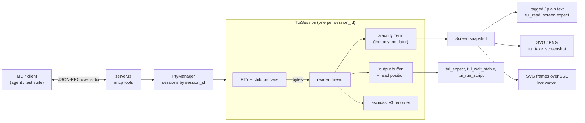

# ShadowPTY technical reference

Tool parameters, screen format, recording format and architecture. For an overview, see the [README](../README.md).

- [Tools](#tools)
- [Pattern syntax](#pattern-syntax)
- [Reading the screen](#reading-the-screen)
- [Recording](#recording)
- [Session report](#session-report)
- [Live viewer](#live-viewer)
- [Architecture](#architecture)
- [Development](#development)
- [Limitations](#limitations)

---

## Tools

ShadowPTY exposes 14 tools. Every tool except `tui_list_sessions` takes an optional `session_id` (default `"default"`); each session has its own process, screen and recording.

| Tool | What it does |
| :--- | :--- |
| [`tui_start`](#tui_start) | Spawn a command in a new PTY session |
| [`tui_input`](#tui_input) | Send keys and text |
| [`tui_paste`](#tui_paste) | Send text as one bracketed paste |
| [`tui_expect`](#tui_expect) | Wait for a literal or regex in new output or on screen |
| [`tui_wait_stable`](#tui_wait_stable) | Wait until output goes quiet |
| [`tui_wait_gone`](#tui_wait_gone) | Wait until text disappears from the screen |
| [`tui_wait_exit`](#tui_wait_exit) | Wait for the process to exit; get its exit code or signal |
| [`tui_run_script`](#tui_run_script) | Run shell commands one by one, collecting each output |
| [`tui_read`](#tui_read) | Read the screen as tagged text |
| [`tui_take_screenshot`](#tui_take_screenshot) | Render the screen to PNG or SVG |
| [`tui_signal`](#tui_signal) | Send a signal (INT, TERM, HUP, STOP, CONT, …) without ending the session |
| [`tui_resize`](#tui_resize) | Resize the terminal |
| [`tui_list_sessions`](#tui_list_sessions) | List sessions and whether their process has exited |
| [`tui_end`](#tui_end) | Stop a session and its whole process group |

All waits are capped at 120 seconds.

The server sends short usage instructions at initialization, and every tool declares a `title` and annotations so clients can decide what to auto-approve:

| Annotation | Tools |
| :--- | :--- |
| `readOnlyHint` | `tui_read`, `tui_expect`, `tui_wait_stable`, `tui_wait_gone`, `tui_wait_exit`, `tui_list_sessions` |
| `destructiveHint` | `tui_start` (replaces a session with the same id), `tui_input`, `tui_paste`, `tui_run_script`, `tui_signal`, `tui_end`, `tui_take_screenshot` (may overwrite `output_path`) |
| `idempotentHint` | `tui_resize`, `tui_end`, `tui_take_screenshot` |
| `openWorldHint` | `tui_start`, `tui_input`, `tui_paste`, `tui_run_script` (they run or drive arbitrary programs) |

`tui_resize` is the only non-read-only tool that is not destructive.

### `tui_start`

Spawns `command` in a new pseudo-terminal. Starting a `session_id` that is already running stops the old session first (killed and reaped); other sessions are untouched.

| Parameter | Type | Default | |
| :--- | :--- | :--- | :--- |
| `command` | string | required | Executable, e.g. `"htop"`, `"bash"` |
| `args` | string[] | `[]` | Arguments |
| `rows`, `cols` | integer | `24`, `80` | Terminal size |
| `record_path` | string | – | Record the session to this `.cast` file |
| `report_path` | string | – | Write a JSON Lines [session report](#session-report) of every check to this file |
| `session_id` | string | `"default"` | |
| `live` | boolean | `false` | Serve a view-only page where a person can watch the session live; see [Live viewer](#live-viewer) |

```json
{ "command": "htop", "rows": 43, "cols": 155, "record_path": "/tmp/htop.cast", "report_path": "/tmp/htop.jsonl", "session_id": "htop" }
```

The reply names the files, e.g. `…, recording to '/tmp/htop.cast', reporting to '/tmp/htop.jsonl')`. A report file that can't be created fails the call before anything is started.

With `live: true` the reply ends with the link to hand to the person (the agent shouldn't open it):

```text
Started command 'htop' in PTY session 'htop' (pid: 12345, rows: 43, cols: 155), watch live at http://127.0.0.1:52817/s/htop?t=3f9c…
```

#### Asking the person

When `record_path`, `report_path` and `live` are all left unset, the person decides how the session is captured, through an MCP [elicitation](https://modelcontextprotocol.io/specification/draft/client/elicitation) form the client shows them. `tui_start` never waits for them: the session starts at once and records, with a report, to the default files until they decide. Their decision then moves or deletes the files when the session ends.

- **Protocols before 2026-07-28:** the form goes out in the background as the session starts. It also offers watching live; if the person turns that on, the live page opens in their browser for the running session. Without an answer within 30 seconds, the defaults apply. A `tui_end` that comes while the form is still open waits for it (at most those 30 seconds).
- **Protocol 2026-07-28 (e.g. Claude Code):** a server can only ask during a call, so `tui_end` returns the form as an input request and the client calls it again with the answer. It's too late to offer watching live then; the `tui_start` reply tells the agent to ask the person and pass `live: true`.

| Field | Default | |
| :--- | :--- | :--- |
| `record`, `record_path` | on, `<cwd>/<command>.cast` | Keep the recording, and where |
| `report`, `report_path` | on, `<cwd>/<command>.report.jsonl` | Keep the report, and where |
| `live` (start form only) | off | Serve the live viewer and open it in the person's default browser (`open` on macOS, `xdg-open` elsewhere) |

The default paths are in the server's working directory and never name an existing file (`htop-2.cast`, …). An empty path takes the default, and `~/` is expanded. A file moved to another filesystem is copied, then removed.

- **The defaults are to keep both files.** They apply when the person declines or closes the form, doesn't answer in time, or the client can't show forms; in the last two cases (and when the form is closed) the first reply ends with a hint for the agent to offer the other options. It shows up once. On 2026-07-28, a call that comes back with the form's `requestState` but no answer counts as closing the form.
- The person is asked **once per server**. Their answer, or the defaults, applies to every later session from its start: the first session records to the chosen file, later ones to the next free name beside it (`app.cast`, `app-2.cast`, …). The live page of a session id is opened once; restarting the id switches the open page to the new session.
- What the agent passes always wins, field by field. A call that sets any of the three fields is captured exactly as asked and never involves the person.
- Sessions that end before the person decided keep the default files: one replaced by a new `tui_start` under the same id, one ending while another session's form is out (2026-07-28), and all of them if the server exits first.

The `tui_end` reply says where the files went, e.g. `Terminated session 'default' … Recording saved to '/work/htop.cast'. Report '/work/htop.report.jsonl': 3 checks, 3 passed, 0 failed`.

### `tui_input`

Sends text and key tokens.

```json
{ "keys": "echo 'Hello ShadowPTY'<ENTER>" }
```

| Tokens | |
| :--- | :--- |
| Keys | `<ENTER>` `<RETURN>` `<ESC>` `<ESCAPE>` `<TAB>` `<SPACE>` `<BACKSPACE>` `<DELETE>` `<DEL>` `<INSERT>` `<INS>` `<SHIFT+TAB>` `<S-TAB>` `<BACKTAB>` |
| Navigation | `<UP>` `<DOWN>` `<LEFT>` `<RIGHT>` `<HOME>` `<END>` `<PAGEUP>` `<PAGEDOWN>` |
| Function keys | `<F1>` … `<F12>` |
| Modifiers | `<CTRL+C>` / `<C-C>`, `<CTRL+\>` / `<C-\>`, `<CTRL+]>`, `<CTRL+SPACE>`, `<CTRL+@>`, `<CTRL+?>`, `<ALT+X>` / `<M-X>` |

### `tui_paste`

Sends `text` wrapped in bracketed-paste markers (DECSET 2004), so shells and editors treat a multiline script as one paste rather than typed keys. Text containing the end marker `ESC[201~` is rejected.

### `tui_expect`

Waits until `pattern` appears, or the first of several `patterns`, so the agent doesn't need sleep-and-poll loops.

| Parameter | Type | Default | |
| :--- | :--- | :--- | :--- |
| `pattern` | string | – | Text or regex. Give `pattern` or `patterns` |
| `patterns` | string[] | – | Several; waits for whichever appears first |
| `syntax` | `"literal"` \| `"regex"` \| `"glob"` | `"literal"` | Applies to every pattern; see [Pattern syntax](#pattern-syntax) |
| `is_regex` | boolean | `false` | Older form of `syntax: "regex"` |
| `screen_mode` | boolean | `false` | Match the rendered screen instead of new output |
| `include_context` | boolean | `false` | Stream mode: also show output before and after the match |
| `timeout_ms` | integer | `10000` | |

- **Stream mode** (default) searches output the agent hasn't seen yet — neither returned by `tui_read` nor matched by an earlier `tui_expect` — so it never matches stale text. A match consumes output up to its end.
- **Screen mode** matches what is actually drawn, including text built from cursor moves and overwrites.
- With `patterns`, the match that starts earliest wins (if two start at the same place, the one listed first). Only output up to that match is consumed. The reply names the winner, numbered from 1, e.g. `Matched pattern 2 of 3 ('Permission denied'): "Permission denied"`.
- **The reply** names what matched. In screen mode it also gives the row (from 1) and the full line, e.g. `Matched "READY" on row 3: "Status: READY" in session 'default'`. In stream mode, `include_context: true` adds up to 500 characters of output before the match and after it; the part after stays unread, so a later `tui_expect` can still match it.
- If the process exits first, it fails right away and returns the last output.

```json
{ "pattern": "Build (succeeded|failed)", "syntax": "regex", "timeout_ms": 60000 }
```

```json
{ "patterns": ["Password:", "Permission denied", "$ "], "timeout_ms": 5000 }
```

### `tui_wait_stable`

Waits until no output has arrived for `quiet_period_ms` (default `100`), up to `max_wait_ms` (default `3000`). Returns immediately if the process has exited. Use it before `tui_read` or a screenshot.

### `tui_wait_gone`

Waits until text is no longer on the rendered screen, e.g. a spinner, `Loading…` or a modal, and reports how long that took. Takes `pattern` or `patterns` (then waits until none of them shows), `syntax` (see [Pattern syntax](#pattern-syntax)), and `timeout_ms` (default `10000`).

```json
{ "pattern": "Loading", "timeout_ms": 30000 }
```

```text
'Loading' is no longer on screen in session 'default' (after 1840 ms)
```

- Returns at once if the text isn't showing. If it may not have appeared yet, wait for it first with `tui_expect` and `screen_mode`, then call `tui_wait_gone`.
- Re-checks whenever the screen changes. Fails right away if the process exits with the text still on screen, and on timeout shows the current screen.

### `tui_wait_exit`

Waits until the session's process exits (`timeout_ms`, default `10000`) and reports how it ended, plus any output not yet returned by `tui_read` or `tui_expect` (the last 4000 characters). Returns immediately if the process has already exited. The session stays open, so `tui_read` and screenshots still show the final screen until `tui_end`.

```text
Process in session 'default' exited with code 3.
Unread output:
Build failed: 2 errors
```

A process killed by a signal reports e.g. `killed by signal 9 (SIGKILL)`. If it's still running at the timeout, the call fails with the latest output.

### `tui_run_script`

Runs `commands` one at a time in a shell session, waiting for `prompt_pattern` (default `"$"`; `syntax` sets how it's read, see [Pattern syntax](#pattern-syntax)) after each, with `timeout_ms` (default `30000`) per command. Returns each command's output. Earlier output is ignored and each command's echo is skipped, so a command that contains the prompt text doesn't end its own wait. Stops at the first command whose prompt doesn't show up.

```json
{ "commands": ["cargo build", "cargo test"], "prompt_pattern": "READY> " }
```

For zsh or custom prompts, set `prompt_pattern` explicitly (e.g. `PS1='READY> '`).

### `tui_read`

Returns the screen as tagged text (see [Reading the screen](#reading-the-screen)). Everything on screen counts as seen: a later stream-mode `tui_expect` only matches newer output.

### `tui_take_screenshot`

Renders the current screen from the same emulator state `tui_read` uses, so text, colors and layout match.

| Parameter | Type | Default | |
| :--- | :--- | :--- | :--- |
| `format` | `"png"` \| `"svg"` | `"png"` | |
| `output_path` | string | – | Absolute path; the parent directory must exist |
| `include_cursor` | boolean | `true` | |
| `scale` | integer | `1` | PNG only (`1` or `2`) |

- Without `output_path`, a PNG is returned inline as an image the agent can see; an SVG is returned as text.
- With `output_path`, the file is written and the tool returns its size in cells, pixels and bytes.
- PNGs use an embedded JetBrains Mono, so they look the same on every machine; box-drawing characters are drawn so borders join between cells. SVG output is deterministic, so it can be used for golden-file tests.
- Handles 16/256/truecolor, colors the app redefines (OSC 4/10/11), bold, dim, italic, inverse, hidden, strikethrough, underline styles, wide and combining characters, and the cursor shape.

### `tui_signal`

Sends a signal to the running app without ending the session, e.g. to check that it shuts down cleanly on `TERM`, reloads on `HUP`, or keeps its screen intact across `STOP` / `CONT`.

| Parameter | Type | Default | |
| :--- | :--- | :--- | :--- |
| `signal` | string | required | `INT`, `TERM`, `HUP`, `QUIT`, `KILL`, `TSTP`, `STOP`, `CONT`, `USR1`, `USR2`, `WINCH`, `ALRM`, `PIPE`, `TTIN`, `TTOU`, and the crash signals `ABRT`, `SEGV`, `BUS`, `FPE`, `TRAP`; case-insensitive, `SIG` prefix optional |
| `target` | string | `"foreground"` | `"foreground"`: the terminal's foreground process group, as Ctrl+C does (in a shell, the running job; otherwise the app and its children). `"process"`: only the process `tui_start` launched, e.g. the shell itself |
| `session_id` | string | `"default"` | |

```json
{ "signal": "TERM" }
```

```text
Sent SIGTERM to the foreground process group (48213) in session 'default'
```

- The call returns right away; check the effect with `tui_expect` or `tui_wait_exit` (which then reports e.g. `killed by signal 15 (SIGTERM)`).
- `<CTRL+C>` and `<CTRL+Z>` in `tui_input` go through the terminal, which turns them into signals only while the app leaves keyboard signals on. Full-screen apps in raw mode read them as keys instead; `tui_signal` always delivers.
- A process that isn't running under a job-control shell ignores `TSTP` unless it handles it (the kernel discards it for a session's own process group); send `STOP` to pause it regardless.
- The crash signals simulate a crash (by default the process dies, possibly with a core dump), e.g. to test a crash handler or that a supervisor restarts the app. `TRAP` is the breakpoint signal: to break into a program running under `gdb` or `lldb` in the session, send `INT` instead, as Ctrl+C would.
- Fails if the process has already exited. Signal numbers follow the platform (e.g. `USR1` is 10 on Linux, 30 on macOS).
- Recordings get a marker event (`m`) named after the signal.

### `tui_resize`

Resizes the PTY and the screen (`rows`, `cols`), to test how an app re-lays out. Text is re-wrapped like a real terminal.

### `tui_list_sessions`

```json
[
  { "id": "build", "command": "sh", "pid": 12001, "rows": 43, "cols": 155, "recording": false, "exit_status": { "exit_code": 0 } },
  { "id": "htop", "command": "htop", "pid": 12345, "rows": 43, "cols": 155, "recording": true, "exit_status": null }
]
```

`exit_status` is `null` while the process runs, then `{ "exit_code": N }`, `{ "signal": N }`, or `"unknown"` if the status couldn't be read.

### `tui_end`

Stops a session: kills its whole process group (so background children don't leak), reaps the process and closes its recording and report. If the session writes a [report](#session-report), its `exit` and `summary` lines are written before the call returns, and the reply adds the totals:

```text
Terminated session 'default' for command 'sh' (pid: 4242). Report '/tmp/app.jsonl': 5 checks, 4 passed, 1 failed
```

---

## Pattern syntax

`tui_expect`, `tui_wait_gone` and `tui_run_script` read their patterns according to `syntax`:

| `syntax` | Meaning | Example |
| :--- | :--- | :--- |
| `"literal"` (default) | The exact text | `"Permission denied"` |
| `"regex"` | A [Rust regular expression](https://docs.rs/regex/latest/regex/#syntax) | `"Build (succeeded\|failed)"` |
| `"glob"` | A shell-style wildcard pattern | `"Error:*"`, `"*[Ee]rror*"`, `"v?.?"` |

Globs match **anywhere** in the text, not the whole of it, like `rust-expect`:

- `*` matches any characters and `?` one character, **within a line**, so `Error:*` matches the rest of the error line instead of all output after it;
- `[abc]`, `[a-z]` and `[!abc]` (or `[^abc]`) match one character from, or not from, a set;
- `\` makes the next character literal (`\*`), and an unclosed `[` is literal;
- everything else, including `.`, matches itself.

`is_regex: true` is the older way to say `syntax: "regex"` and still works. A call that sets both and contradicts itself (e.g. `syntax: "glob"` with `is_regex: true`) is rejected.

---

## Reading the screen

`tui_read` returns one line per screen row, with styles as lightweight tags. Adjacent cells with the same style are merged, and trailing blanks and empty rows are trimmed to save tokens.

```text
<fg:green><bold>SUCCESS</bold></fg> Process completed in 0.42s
<fg:bright-black>Press [q] to exit</fg>
<bg:blue><fg:#ffcc00> STATUS </fg></bg> <inverse>main</inverse>
```

| Tag | Meaning |
| :--- | :--- |
| `<fg:NAME>`, `<bg:NAME>` | ANSI colors 0–15: `black` `red` `green` `yellow` `blue` `magenta` `cyan` `white`, and `bright-*` variants |
| `<fg:idx:N>`, `<bg:idx:N>` | 256-color palette index 16–255 |
| `<fg:#rrggbb>`, `<bg:#rrggbb>` | Truecolor |
| `<bold>` `<dim>` `<italic>` `<strikethrough>` `<hidden>` `<inverse>` | Text attributes |
| `<underline>`, `<underline:double\|curly\|dotted\|dashed>` | Underline styles |

Default foreground and background carry no tag.

---

## Recording

Pass `record_path` to `tui_start` and the session is written as [asciicast v3](https://docs.asciinema.org/manual/asciicast/v3/): output (`o`), input (`i`), resizes (`r`), markers (`m`, the name of each signal sent with `tui_signal`) and exit (`x`, the real exit code, or `128 + signal` for a killed process, e.g. `137` after `tui_end`), with timestamps taken when the output was produced. The reader runs continuously, so recordings keep real timing even while the agent is idle.

```json
{"version": 3, "term": {"cols": 155, "rows": 43, "type": "xterm-256color"}, "timestamp": 1726960000, "command": "htop"}
[0.152, "o", "\u001b[?2004h$ "]
[1.204, "i", "fastfetch\r"]
[0.342, "r", "120x40"]
[2.117, "m", "SIGINT"]
[0.850, "x", "0"]
```

Replay or convert it:

```bash
asciinema play session.cast          # real timing
asciinema play -s 2 session.cast     # 2× speed
agg session.cast session.gif         # GIF via agg
```

[`examples/neofetch/`](../examples/neofetch/) contains a full recorded session (`fastfetch` in `nix-shell`) with the MCP calls that produced it:

[](https://asciinema.org/a/h4tKuB4nJSyDvGUo)

---

## Session report

A recording shows what happened on screen; the report shows what was **checked**. Pass `report_path` to `tui_start` and the session writes [JSON Lines](https://jsonlines.org) to that file: one JSON object per line, for inputs, every expectation and wait with its result and timing, screenshots, the exit status and a final summary. Attach it to a CI run or a bug report next to the recording.

```json
{"at_ms":0,"type":"start","session_id":"default","command":"sh","args":["-c","./app"],"rows":43,"cols":155,"pid":4242,"record_path":"/tmp/app.cast","timestamp":1790000000,"version":1}
{"at_ms":350,"type":"expect","target":"screen","syntax":"literal","patterns":["Ready"],"timeout_ms":10000,"passed":true,"elapsed_ms":310,"pattern_index":0,"matched":"Ready","row":2,"error":null}
{"at_ms":352,"type":"input","keys":"q","bytes":1}
{"at_ms":5360,"type":"expect","target":"stream","syntax":"literal","patterns":["Quit? (y/n)"],"timeout_ms":5000,"passed":false,"elapsed_ms":5004,"pattern_index":null,"matched":null,"row":null,"error":"'Quit? (y/n)' not found in output: timed out after 5s. Unread output (last 500 chars):\n…"}
{"at_ms":5400,"type":"screenshot","format":"png","path":"/tmp/app.png","bytes":48213}
{"at_ms":5530,"type":"exit","exit_status":{"signal":9}}
{"at_ms":5531,"type":"summary","checks":2,"passed":1,"failed":1,"exit_status":{"signal":9},"duration_ms":5531}
```

Every line has `type` and `at_ms`: milliseconds since the session started, when the line was written. A check's line is written when it finishes, so it started at `at_ms - elapsed_ms`. Fields that don't apply are `null`. Durations are in milliseconds.

| `type` | Written when | Fields |
| :--- | :--- | :--- |
| `start` | The session starts (always the first line) | `session_id`, `command`, `args`, `rows`, `cols`, `pid`, `record_path` (`null` without a recording), `timestamp` (Unix seconds), `version` (`1`) |
| `input` | `tui_input` | `keys` as given (e.g. `"ls<ENTER>"`), `bytes` sent |
| `paste` | `tui_paste` | `text`, `bytes` |
| `resize` | `tui_resize` | `rows`, `cols` |
| `signal` | `tui_signal` succeeds | `signal` (e.g. `"SIGINT"`), `target` (`"foreground"` / `"process"`), `id` (the process group or process it was sent to) |
| `expect` | `tui_expect` ends | `target` (`"stream"` / `"screen"`), `syntax` (`"literal"` / `"regex"` / `"glob"`), `patterns` (as written), `timeout_ms`, `passed`, `elapsed_ms`; on success `pattern_index` (from 0) and `matched`, plus `row` (from 1, screen mode, as in the reply); on failure `error` |
| `wait_gone` | `tui_wait_gone` ends | `syntax`, `patterns`, `timeout_ms`, `passed`, `elapsed_ms`, `error` |
| `wait_stable` | `tui_wait_stable` ends | `quiet_period_ms`, `timeout_ms`, `passed`, `elapsed_ms`, `error` |
| `wait_exit` | `tui_wait_exit` ends | `timeout_ms`, `passed`, `elapsed_ms`, `exit_status`, `error` |
| `run_script` | `tui_run_script` ends | `commands`, `prompt`, `syntax`, `timeout_ms` (per command), `passed`, `elapsed_ms`, `completed` (commands that finished), `error` |
| `screenshot` | `tui_take_screenshot` succeeds | `format` (`"png"` / `"svg"`), `path` (`null` when returned inline), `bytes` |
| `exit` | The process exits, after its last output | `exit_status`: `{"exit_code": N}`, `{"signal": N}` or `"unknown"`, as in `tui_list_sessions` |
| `summary` | The session ends (always the last line) | `checks`, `passed`, `failed`, `exit_status` (`null` if it was never reported), `duration_ms` |

- **Checks** are the lines with a boolean `passed`: `expect`, `wait_gone`, `wait_stable`, `wait_exit` and `run_script`. `error` is the same message the tool reply gives. `wait_exit` passes when the process exits, whatever its exit code (the code is in `exit` and `summary`); `run_script` fails if any command's prompt didn't appear. Calls rejected before they start waiting (e.g. an invalid regex) aren't logged.
- **`exit`** is written once, as soon as the process is gone, so it can come before later checks such as `tui_wait_exit`.
- **`summary`** is written once, when the session ends: `tui_end`, a `tui_start` that replaces the same `session_id`, or the server shutting down cleanly with the session still open. It isn't written when the process exits, since the agent can still check things afterwards. If the session is ended while its process runs, the `exit` line records the kill (`{"signal": 9}`) just before the summary.
- **Crash-safe:** each line is flushed as soon as it's written, so if the server dies the file still holds every line so far, each valid on its own; only the `summary` is missing.
- **Watch it live** while the agent works:

```bash
tail -f /tmp/app.jsonl
tail -f /tmp/app.jsonl | jq -c 'select(.passed == false)'   # failed checks only
```

The same events are available in process to anything embedding ShadowPTY, with or without a report file: `PtyManager::subscribe_report_session` returns a `ReportSubscription` with the events so far (`history`: the `start` entry plus the latest 1000; `dropped` counts older ones left out, and `totals` counts every check) and a `tokio::sync::broadcast` receiver (`live`) for the rest, with nothing missed or repeated in between. A subscriber that falls more than 256 events behind skips the oldest.

---

## Live viewer

`tui_start` with `live: true` lets a person watch a session in a browser while the agent drives it: the screen as it changes, a timeline of inputs and checks with pass/fail, and running counts. The page is view-only.

| URL | |
| :--- | :--- |
| `http://127.0.0.1:PORT/s/<session_id>?t=TOKEN` | The session's page (the link `tui_start` returns) |
| `http://127.0.0.1:PORT/?t=TOKEN` | List of live sessions, refreshed every 5 s |
| `http://127.0.0.1:PORT/s/<session_id>/events?t=TOKEN` | The page's event stream |

The server starts on the first `live: true` and is shared by every session of that MCP server; it stops with the MCP server. `PORT` is picked by the OS and `TOKEN` is new each time. When a session ends (its process exits, or `tui_end`), its page keeps the final screen and timeline until the id is reused or the server stops. Starting the id again with `live: true` switches the open page to the new session; starting it without `live` takes it off the viewer.

**Page.** One self-contained HTML file (no external scripts, styles or fonts), light and dark, one column on narrow screens. The terminal takes most of the page, in a window with a `LIVE` / `ENDED` / `OFFLINE` badge; an ended session's final screen is dimmed and labelled with how it ended. Under it, **Latest** shows the agent's last action. The side panel has the verdict (passed, failed, checks, a pass/fail bar, elapsed time, frames per second), the summary once it arrives, and the timeline with filters (All, Checks, Failures, Inputs). The header shows the session id, command line and status (`running`, `exited with code N`, `killed by signal N`, `ended · …`). It reconnects by itself (`EventSource`) and replays the timeline on reconnect.

**Events.** Server-sent events (`text/event-stream`), each with one line of JSON data:

| Event | Data | When |
| :--- | :--- | :--- |
| `status` | `{"session_id", "command", "state", "exit_status", "started_ms", "ended_ms"}` | On connect and when it changes |
| `frame` | `{"seq", "rows", "cols", "svg"}` | On connect (latest frame) and when the screen changes |
| `report` | One session-report event, e.g. `{"type": "expect", "at_ms": 123, "passed": true, …}` | Past ones on connect, then as they happen |

- `state` is `running`, `exited` (the process ended, the session is still open) or `closed` (`tui_end`, or the id was replaced). `exit_status` is `null`, `{"exit_code": N}`, `{"signal": N}` or `"unknown"`, as in `tui_list_sessions`. Times are milliseconds since the Unix epoch.
- `svg` is the same render as `tui_take_screenshot` with `format: "svg"`, taken from the session's one emulator, so the person sees exactly what the agent reads. `seq` increases with each frame; an unchanged screen isn't sent again.
- `report` events use the JSON session report's format (`type`: `start`, `input`, `paste`, `resize`, `expect`, `wait_gone`, `wait_stable`, `wait_exit`, `run_script`, `screenshot`, `exit`, `summary`). A check is any event with a `passed` field; failed ones carry `error`. The page counts checks as they arrive and takes the final numbers from `summary`.

**Frame rate and cost.** A per-session task watches the session's revision counter and exit status. When the screen changed, it takes a `Screen` snapshot under the terminal lock and renders the SVG outside it on a blocking thread, at most 15 frames per second (`MAX_FPS` in `src/live/frames.rs`) while someone watches, and once per second otherwise (so a late viewer still sees a recent screen right away). A burst of output becomes one frame. Frames are handed over through a `watch` channel, so a slow viewer just gets the latest frame and never holds up the reader or other viewers. On the benchmark's busy 43×155 screen a frame costs about 0.19 ms to capture and 0.5 ms to render (`cargo bench -- render`, `capture` + `screenshot_svg`, Apple M-series), about 1% of a core at 15 fps.

**Security.**

- Bound to 127.0.0.1 only, on an ephemeral port.
- Every request must carry the server's token (128 random bits from `/dev/urandom`, hex) as `?t=`; otherwise `403`. The token is compared in constant time.
- The `Host` header must be `127.0.0.1:PORT` or `localhost:PORT`; otherwise `421`. This stops DNS-rebinding pages from reading the stream.
- Read-only: only `GET` is served (`405` otherwise), and nothing from the browser reaches the session.
- Responses carry `Cache-Control: no-store`, `Referrer-Policy: no-referrer` (the token is in the URL), a strict `Content-Security-Policy` and `X-Frame-Options: DENY`. The screen is shown as an image, so SVG content can't run script.
- At most 64 connections at once; a client that doesn't send its request within 5 s, or doesn't read for 10 s, is dropped.
- Anyone on the same machine who gets the link can watch; treat it like the session's output.

The `report` events are the [session report](#session-report)'s lines, sent whether or not the session writes a report file; a viewer that connects mid-session first gets the ones so far.

**Limitations.** Plain HTTP on loopback only, so it can't be watched from another machine without a tunnel. No scrollback, like `tui_read`.

---

## Architecture



- **One reader per session** reads the PTY continuously, so apps never stall on a full buffer and recording timestamps are real. Tools never read the PTY themselves; waits watch a revision counter the reader bumps.
- **One emulator.** Text, screen matching and screenshots all come from the same alacritty `Term`, so they can't disagree. Synchronized-output frames (`?2026`) are only shown once complete, or after a 150 ms timeout.
- **No lock is held while waiting**, so a long `tui_expect` never blocks `tui_input` or `tui_end` on the same session.
- **stdout is reserved for JSON-RPC**; logs go to stderr.

On the first request that identifies the client (`initialize` on protocols before 2026-07-28; `server/discover` or the first `tui_start` on 2026-07-28, where the client sends this with each request), the server logs one line saying who connected and what it supports, for example:

```
Client connected: claude-code 2.1.288, protocol 2026-07-28, elicitation: form and url, tasks (io.modelcontextprotocol/tasks): no, extensions: none, experimental: none, sampling: no, roots: yes
```

`elicitation` tells whether the capture form can be shown; `tasks` whether the client declares the MCP Tasks extension.

Design notes: [`RFC-single-emulator-core.md`](proposals/RFC-single-emulator-core.md), [`RFC-screenshots-on-shared-term.md`](proposals/RFC-screenshots-on-shared-term.md). Domain vocabulary: [`CONTEXT.md`](../CONTEXT.md).

| Module | Role |
| :--- | :--- |
| `src/server.rs` | MCP tool definitions |
| `src/pty_manager.rs` | Session map |
| `src/session.rs` | PTY, reader thread, input, waits, teardown |
| `src/output.rs` | Output buffer, patterns, stream expect |
| `src/screen.rs` | Screen snapshot, tagged and plain text |
| `src/palette.rs` | Color and style resolution |
| `src/screenshot.rs`, `src/rasterizer.rs` | SVG and PNG rendering |
| `src/capture.rs` | Asking the person how sessions are captured (elicitation) |
| `src/input.rs` | Key tokens → bytes |
| `src/live/` | Live viewer: HTTP/SSE server, frames, page (`assets/live/index.html`) |
| `src/recorder.rs` | asciicast v3 writer |
| `src/report.rs` | Session report: events, JSON Lines writer, check totals |

---

## Development

Requires Rust 1.88+ (or `nix develop`, which also provides `asciinema`).

```bash
cargo fmt --check
cargo clippy --all-targets -- -D warnings
cargo test --all-targets
cargo bench                      # criterion: emulator, render, output, pty
nix flake check
```

CI runs the first three on macOS and Linux, then every script in `mcp-tests/auto-test/scripts/` with the scripted MCP client below, against the debug build.

`examples/mcp_script.rs` is a scripted MCP client for end-to-end checks without a model: `cargo build --release --example mcp_script`, then `target/release/examples/mcp_script <script.json>` (set `SHADOWPTY_BIN` to test another server binary). The scripts for the capture form and client logging are in `mcp-tests/auto-test/scripts/` (see `mcp-tests/auto-test/README.md`).

Releases ship the binaries, the npm launcher and an MCPB bundle for Claude Desktop. `scripts/pack-mcpb.sh <dir> <version>` builds `dist/shadowpty.mcpb` from the `shadowpty-<target>` binaries in `<dir>` (missing targets are left out, so a local build of one platform works). The bundle is `mcpb/manifest.json` plus `mcpb/server/shadowpty`, a `sh` launcher that picks the binary for the machine and starts it in the configured working directory (or `$HOME` when the host starts it in `/`). A test keeps the manifest's tool list in sync with the server.

The repository is also a Claude Code plugin marketplace: `.claude-plugin/marketplace.json` lists one plugin rooted at the repository, whose `.claude-plugin/plugin.json` declares the npx server and picks up the skill in `skills/shadowpty/` (the same directory `npx skills add` installs from). The skill repeats the server instructions in more depth; when a tool's behavior changes, update both. Check with `claude plugin validate .`.

Tests spawn real processes; screens in tests default to 43×155. Contributor and agent guidelines are in [`CLAUDE.md`](../CLAUDE.md) / [`GEMINI.md`](../GEMINI.md); open work is in [`TODO.md`](../TODO.md).

---

## Limitations

- macOS and Linux only (no Windows ConPTY).
- `TERM`/`COLORTERM` aren't set for the child yet, so it inherits them from the MCP host, and terminal queries (cursor position, device attributes, color queries) aren't answered.
- Visible screen only; scrollback isn't exposed.
